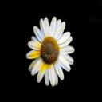

# coloring-b-w-photos-
We followed the assignment of "transform images using an autoencoder neural network. Train an autoencoder DLNN that learns to emulate some form of image processing, such as colorizing black and white photos, or performing super resolution, etc".

We used 3000 pairs of images of flowers as training data and tested it on flower images as well as other black and white photos. 

The results turn out pretty good, flowers are colored in a way that seems "right" or as you expect flowers would be colored. The images that were not flowers were colored in way that is more whimsical, interseting in and of itself. 

