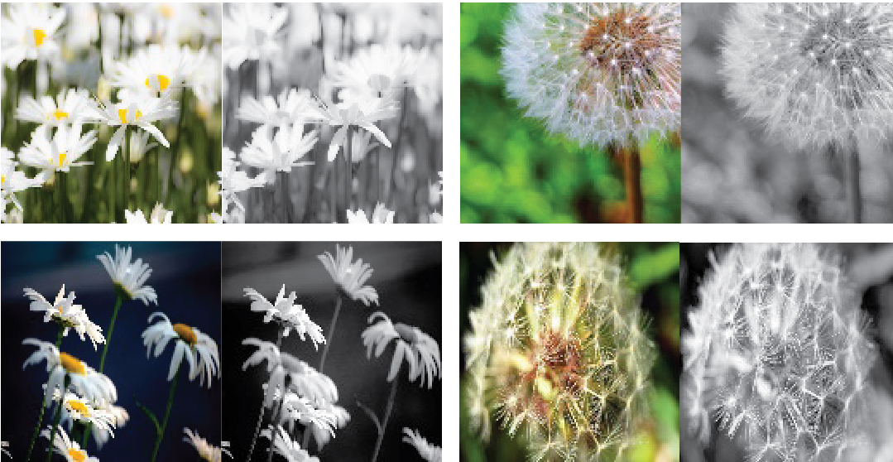
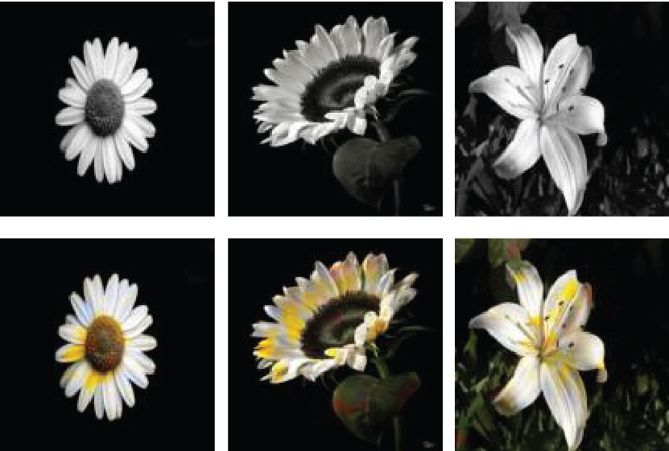
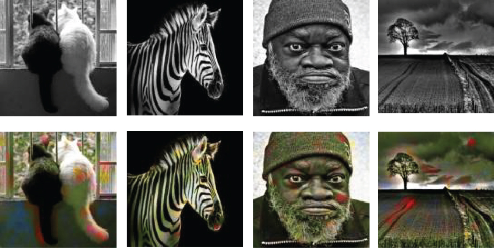
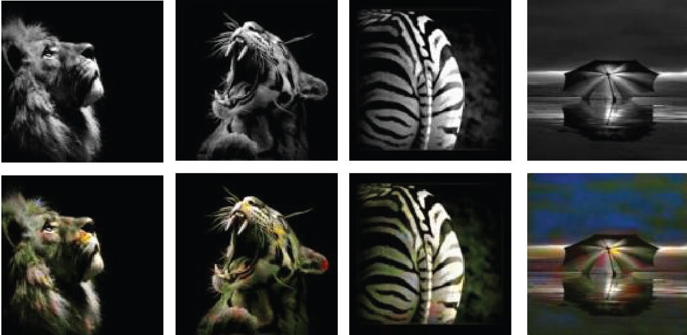

Ran Xu, Ella Dagan and Ferran Altarriba Bertran

# coloring-b-w-photos
We followed the assignment of "transform images using an autoencoder neural network. Train an autoencoder DLNN that learns to emulate some form of image processing, such as colorizing black and white photos, or performing super resolution, etc".

We used 3640 pairs of images of flowers as training data and tested it on flower photos as well as other black and white photos. 

Here are example images from the training dataset (there were also other kinds of flowers):

We tested the network with new black and white images that were not part of the original dataset. The results turn out pretty good, flowers were colored in a way that seems "right" or as you'd expect flowers would be colored.

We then wanted to see how it would color images that have less attributes with the original dataset (e.g. not flowers..). We tested it with a random selection of black and white images. 
The result of the coloring of these images is more whimsical, interseting in and of itself. 

## Model:
We used 3 channels for both gray and color images; Image size is 128 * 128. We tried layer filters are all 64 for all 7 layers, and learning rate is 0.001, and the results are mostly greenish, cannot catch other colors. And then we changed layer 1 ~ 7 layer filters are 64, 128, 256, 256, 256, 128, 64, Learning rate is 0.0001, Batch_size is 10, Interation is 100000.

## How to run:

train: python train.py 
test:  python test.py path_of_the_image

